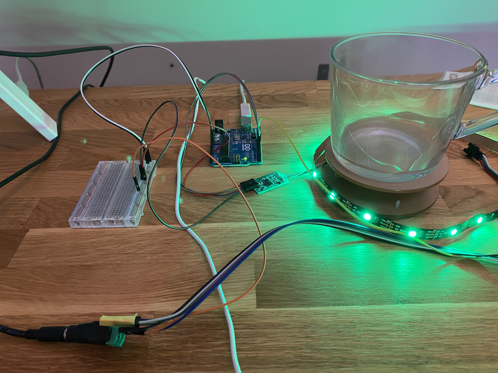
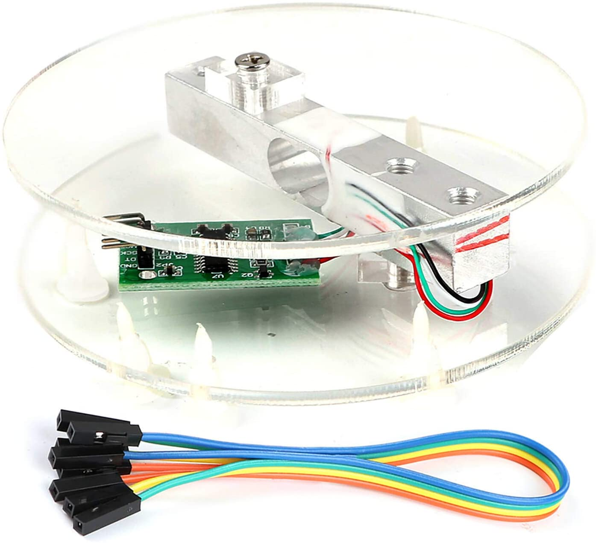
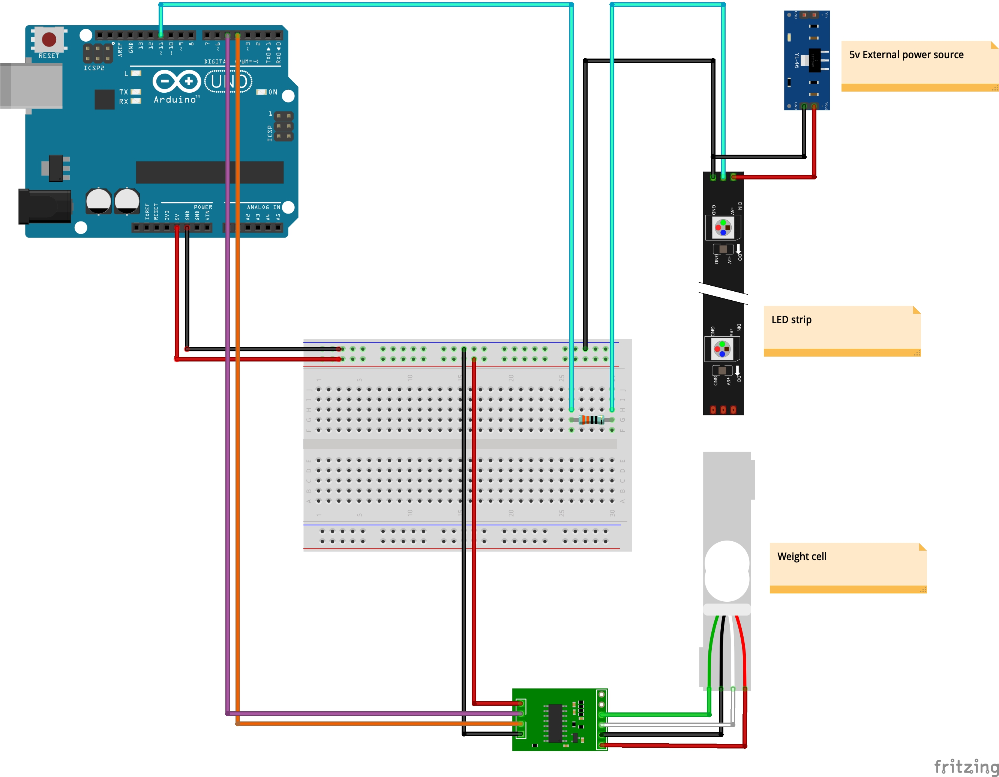

# Water drink reminder

When sitting on the desk all day i tend to forget to drink water.

This projects visually reminds me to drink more water and also shows the progress I make throught the day to reach my drinking goal.

Stay hydrated! 💦 💦

## Parts list

- Arduino Uno
- Neopixel Strip
- HX711 Weighing Sensor Module with load cell
- 300Ω - 500Ω Resistor

- 5V Power Source
- USB Cable
- BreadBoard
- Jump Wires

## Parts images

| Name                                        | Image                                          |
| ------------------------------------------- | ---------------------------------------------- |
| HX711 Weighing Sensor Module with load cell |  |

## Libraries

HX711_ADC: https://github.com/olkal/HX711_ADC

Adafruit_NeoPixel: https://github.com/adafruit/Adafruit_NeoPixel

## Wiring

## Weight cell calibration

Please follow the calibration from the example file `Calibration.ino` of [HX711 lib](https://github.com/olkal/HX711_ADC/blob/master/examples/Calibration/Calibration.ino).

## Configuration

In the `drink-reminder.ino` you need to configure the following values:

Make sure the pins match with your setup:

- HX711_dout = 4; (HX711 dout pin)
- HX711_sck = 5; (HX711 sck pin)
- LEDSTRIP_pin = 11; (led strip data pin)

Update the following variables:

- LEDS_COUNT = 15; (count of the leds you led strip has)
- REMINDER_INTERVAL = 600000; (10 min reminder interval)
- WATERMAX_ML = 2000; (2000 ml drink target)
- WEIGHT_CALIBRATION_VALUE = 385.46; (load cell calibration value)

## Usage

1. Connect the Arduino via USB to your computer
2. Connect the Ledstrip to the external power source
3. Before starting the program remove the glas from the weight
4. Upload the sketch file to your Arduino
5. The led will blink in red during the startup phase
6. After the led shows red (without blinking), put on the glas filled with water
7. When removing or adding the glass the led will blink purple (measuring)
8. Use the glass normally. Refill when needed
9. When putting the glas back on the weight the leds will show your progress (you start with one green led and you reached your goal when all leds are green)
10. Each day you need to restart the program in order to start with total water amount of 0

## Color coding

**Blinking red led**: Starting up

**Red led**: Glas is missing

**Blinking purple led**: Measurement in progress

**Blinking blue leds**: Drink reminder!

**Green led**: Number of leds show drink progress towards your goal

## FAQ

> How do i restart the program?

You can use the reset button on the Arduino.

> Do i need to subtract the weight of my glas?

No, the weight of the glas does not matter. Although you should not use glasses with different weights throughout a day.

> Can i power the ledstrip and the weight sensor module throught the same Arduino?

Yes, you can. But i run into issues with the weight changing when turning LEDs on vs. off. Thats why i switched to power the ledstrip with an external power source.

> Do i need the resistor for the led strip?

I don't use it but it's recommended by Adafruit: https://learn.adafruit.com/adafruit-neopixel-uberguide/best-practices

> Are you missing a capacitor for the led strip?

You are probably right. A capacitor is recommended by Adafruit: https://learn.adafruit.com/adafruit-neopixel-uberguide/best-practices

> The weight cell amount is slowly increasing throughout the day

I see the same issue. Starting with 0.09 the weight of the empty load cell increases throughout the day. Not sure why.

## ToDos

- [ ] 3d print a case
- [ ] transition setup and code to a smaller board
- [ ] move all components + leds into the case
